# Mood - AI-powered Journaling Platform

[Live Link](https://ai-journal-1.vercel.app)

Mood is a smart journaling platform that allows users to express their thoughts and emotions while receiving AI-driven insights. Users can write daily journal entries, and the app generates real-time summaries, subject tags, mood analysis, and sentiment scores. Additionally, users can interact with an AI bot to ask questions based on their personal journal data.

## Problem Mood Solves

In the hustle of daily life, reflecting on our mental state and emotions is often neglected. Mood solves this by offering a platform where users can journal about their day and get instant insights about their mental well-being. Through AI, users receive mood tracking, sentiment analysis, and custom answers based on their journaling history, offering an innovative and intelligent way to better understand their emotional patterns.

## Table of Contents

- [Mood - AI-powered Journaling Platform](#mood---ai-powered-journaling-platform)
  - [Problem Mood Solves](#problem-mood-solves)
  - [Table of Contents](#table-of-contents)
  - [Features](#features)
  - [Tech Stack](#tech-stack)
  - [Installation](#installation)
  - [Usage](#usage)
  - [Screenshots](#screenshots)
  - [Feedback and Contact](#feedback-and-contact)

## Features

- AI-powered journaling with sentiment analysis
- Summarizes journal entries and predicts mood on a scale
- Generates color-coded mood indicators based on sentiment scores (-10 to 10) and a time series plot for sentiment scores
- "Ask AI" feature for users to ask questions about their entries and get AI-driven insights
- Secure user authentication via Clerk and database management using Neon PostgreSQL

## Tech Stack

- **Typescript**
- **Next.js** (frontend and backend framework)
- **Neon PostgreSQL** (database)
- **OpenAI API** (AI and NLP features)
- **LangChain** (contextual analysis for AI responses)
- **Clerk** (authentication)

## Installation

1. Clone this repository:

   ```bash
   git clone https://github.com/sushant0709/ai-journal.git
   cd ai-journal
   ```

2. Install the required dependencies:

   ```bash
   npm install
   ```

3. Set up environment variables:

   - `NEXT_PUBLIC_CLERK_FRONTEND_API`
   - `OPENAI_API_KEY`
   - `DATABASE_URL` for Neon PostgreSQL

4. Run the app locally:
   ```bash
   npm run dev
   ```

## Usage

1. Create an account or log in using Clerk's secure authentication.
2. Begin journaling your thoughts.
3. Receive AI-driven summaries, mood analysis, and sentiment scores.
4. Use the "Ask AI" feature to ask questions about your journal history.

## Screenshots

1. Home Page

   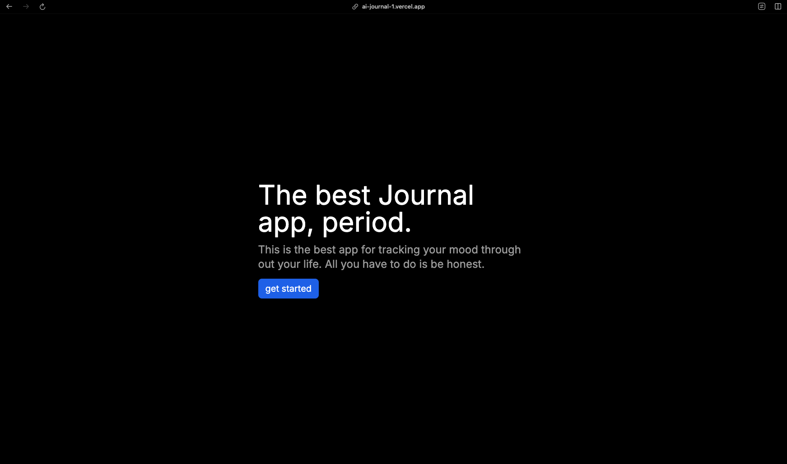

2. Authentication and Journal Dashboard

   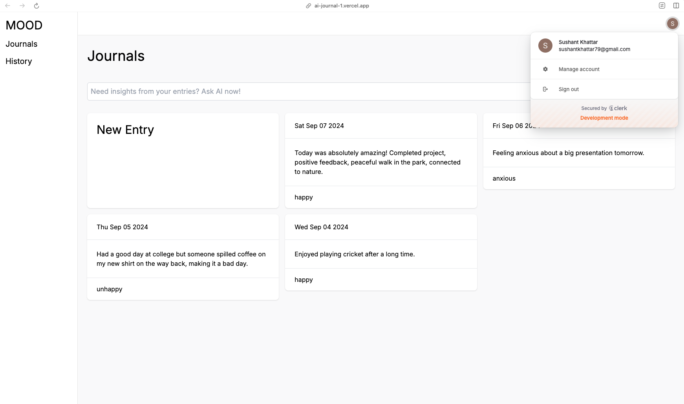

3. Journal Entries with AI generating the color, summary, subject and mood

   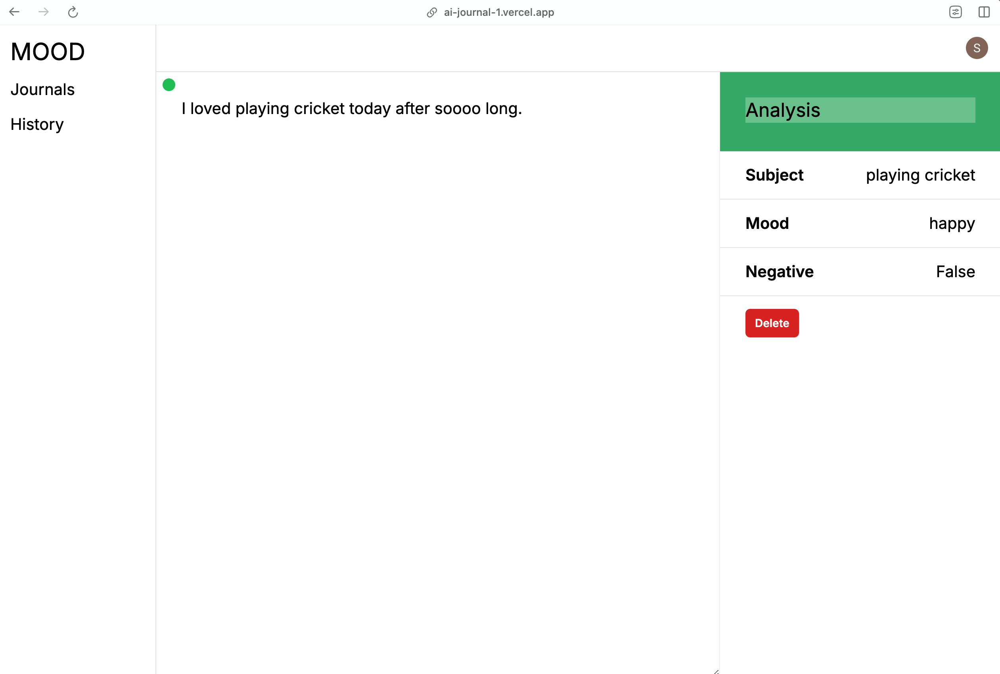

   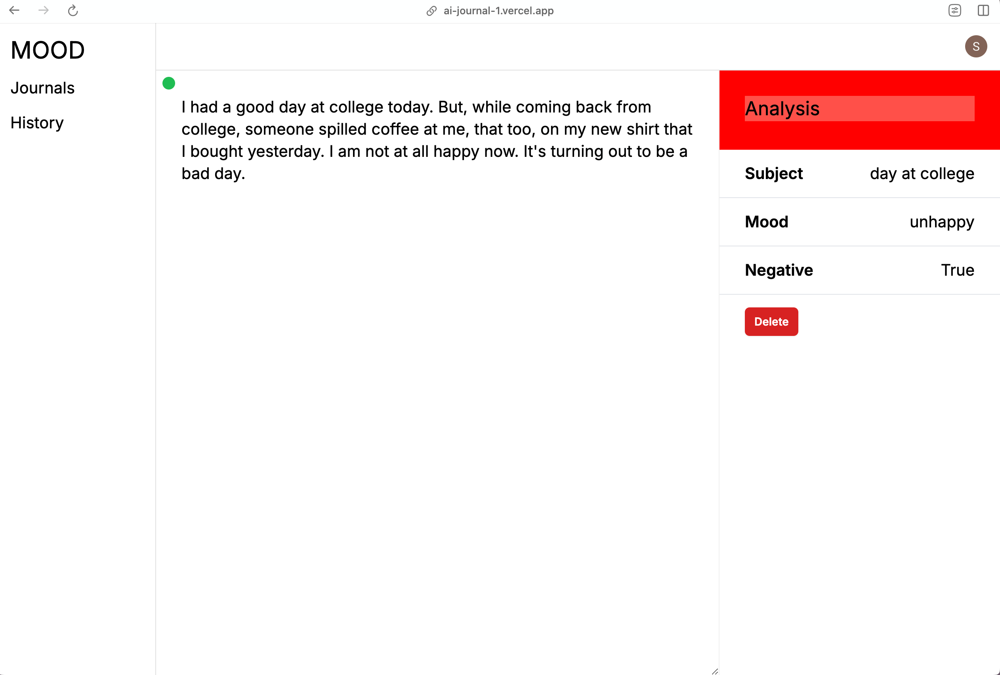

   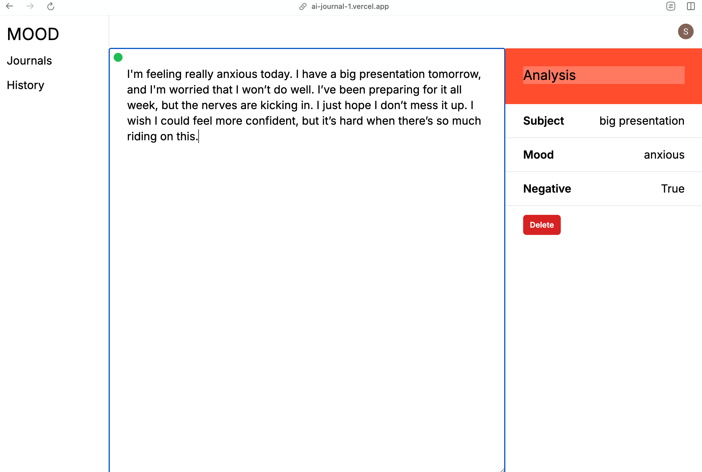

   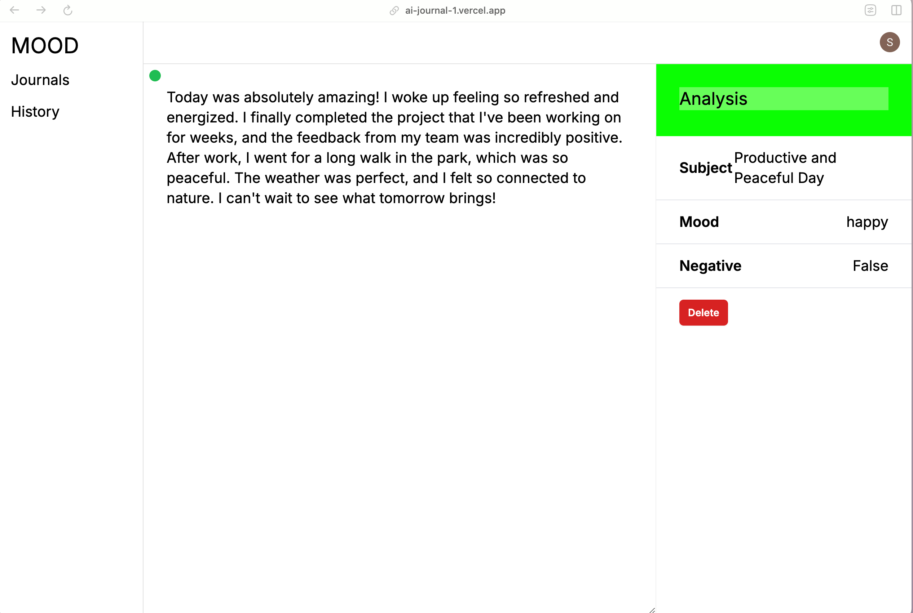

4. AI bot examples with different types of questions

   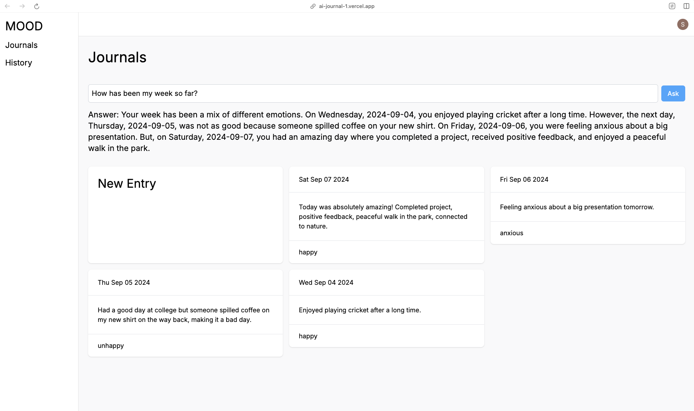

   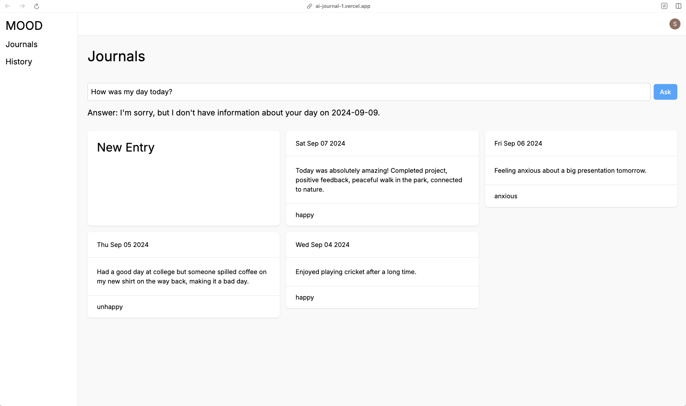

   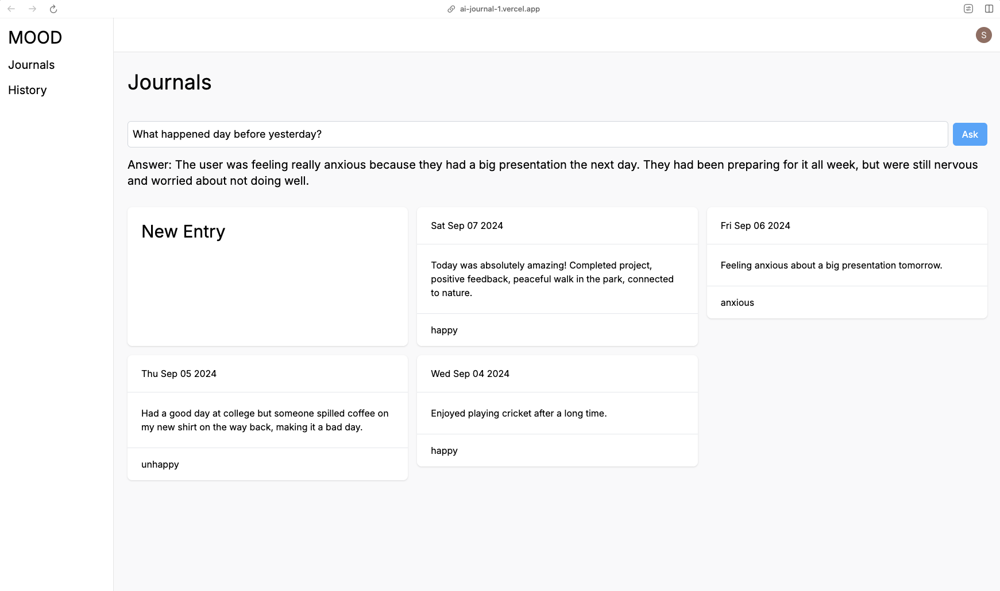

   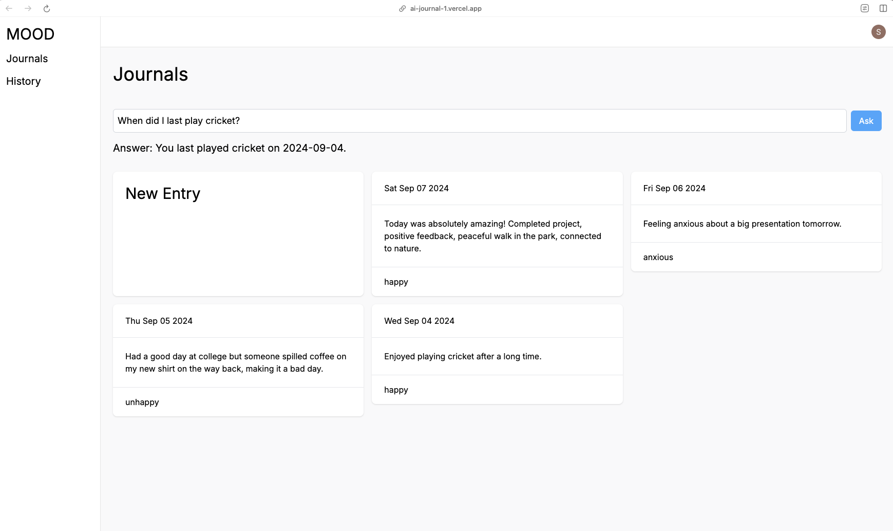

   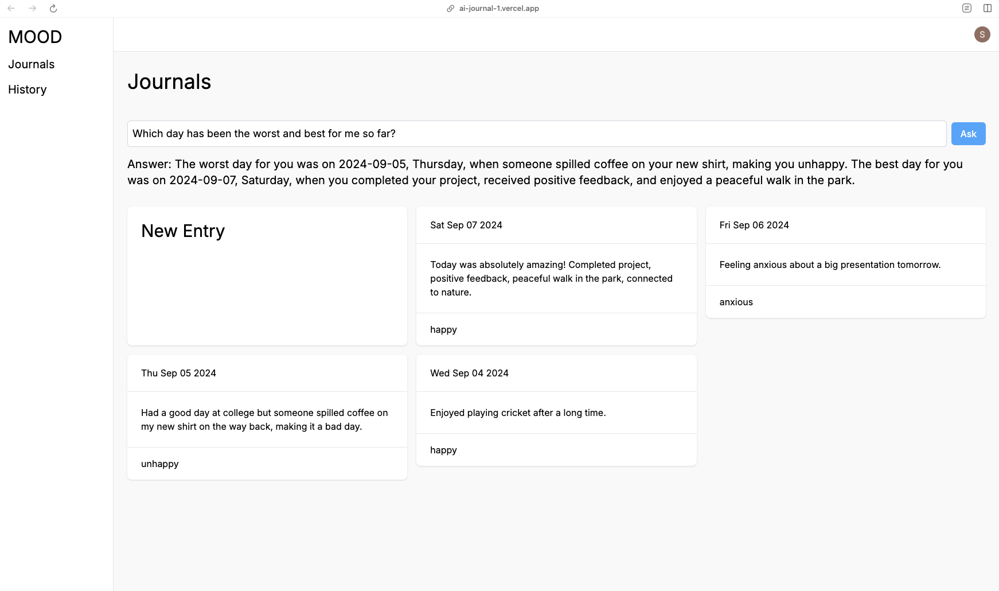

5. Sentiment Score Chart

   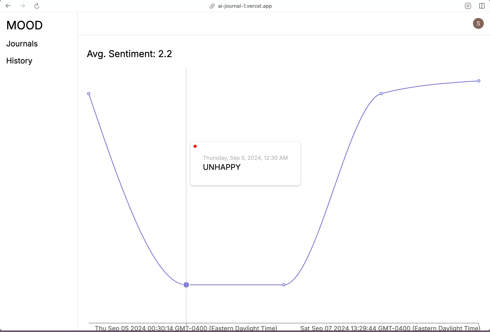

## Feedback and Contact

For feedback or inquiries, feel free to reach out:

- Email: skhatta@ncsu.edu
- LinkedIn: [LinkedIn](https://linkedin.com/in/sushantkhattar)
